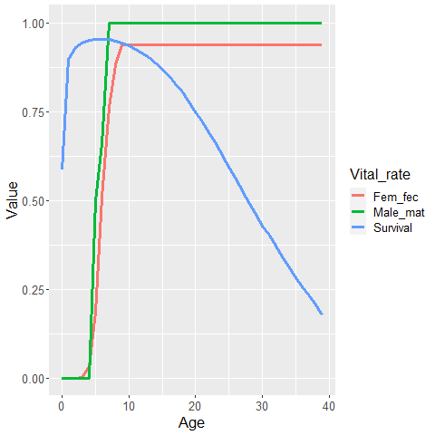

# Design of CKMR Experiments

In this lab, we'll look at various tools to help design CKMR experiments.  We're relatively liberal with what we call a "design" tool.  It could be optimizing
sample allocation to achieve maximum precision for a given parameter (e.g., which sexes and ages to target), or it could simply be examining the effect of different
types of assumption violations on estimator performance.  After all, if a particular type of model is likely to lead to highly biased parameter estimates, it is probably best to adapt model structure, or to leave out certain types of kin comparisons
that are likely to violate assumptions.

We'll consider two specific examples: (1) optimizing sample allocation in @hillary2018genetic white shark example, and (2) conducting individual-based 
simulation to investigate impacts of assumption violations in CKMR models for bearded seals.

## White shark design example

In a previous lab, we looked at @hillary2018genetic model using cross-cohort comparisons of half siblings caught as juveniles.  We might look at a few things with this example, such as how we would partition samples across years and ages if we had the ability to do so.  Presumably, the optimal allocation would depend on the parameter
we were interested in (e.g., population growth ($\lambda$), adult survival ($S$) or
terminal year abundance (call this $N_T$).  Both $\lambda$ and $S$ are parameters of the CKMR model, but $N_T$ is a derived parameter (that is, a *function* of parameters) and can be computed as 

\begin{equation*}
  N_T = N_0 * \exp(\lambda  T) 
\end{equation*}

where $T$ is the number of years in the study.

### Fisher information ideas

We'll be using Fisher information ideas to compare anticipated precision
associated with various white shark sampling designs.  As articulated in the 
slides on design for this workshop, this involves a number of steps:

1. Allocate potential sample sizes to particular years, ages, sexes, etc. (basically the different covariates one is modeling).  These can be expectations (fractions)!

2. Compute sufficient statistics (expected \# of comparisons and number of matches for each covariate combination)

3. Treating these as data, calculate second derivatives of the negative log-pseudo-likelihood at the true parameter values

4. Calculate the expected variance-covariance matrix of parameters in the usual way (inverse of the numeric Fisher information matrix)

5. Calculate expected variance of any functions of parameters using the delta method

6. Compare precision (e.g. CV) associated with different designs!!


Fortunately, we already have the infrastructure set up to help us the negative log-pseudo-likelihood (both in R and TMB).  We *could* use numerical second derivatives (e.g., using the $numDeriv$ package in R) and
not even have to deal with minimizing the NLPL, but Template Model Builder is well set up to produce numerical variance-covariance matrices (including functions of parameters), so why don't we just follow the path of least resistance and fit our model using TMB.  We'll still need
to formulate some alternative designs and what the expected data would look like under each.

### Calculating expected data under different design scenarios

Let's set up "true" population dynamics to consist of a stable population with 1000 adults
which we assume to be constant over a 20 year period. We'll set the assume a constant adult survival probability of 0.94, and that sampling occurs over the last 10 years of the time interval.  We'll assume that sampling targets juveniles (ages 3-8) only, so the most we'll have to go back in time is 8 years (which is why the model needs to go back further in time than just the years that are sampled!!). 

```{r, message=FALSE, warning=FALSE}
Ninit = 1000 
lambda = 0.0
n_yrs = 20
N = matrix(Ninit,20)
phiA = 0.94
ylo=11
yhi=20
ages = c(3:8)  #only 3 - 8 yrs olds sampled

#' Function to calculate # of expected pairs given true adult abundance, adult
#' survival, and # of juvenile white sharks sampled per year (males and female parents modeled together!)
#' @param Npy vector of number of sharks to sample each year (num per year)
#' @param ages a vector of the ages at which individuals are sampled
#' @param age_wts vector of expected proportion of each age in the sample
#' @param N Vector of number of adults per year
#' @param phiA Adult annual survival probability
#' @return This returns two upper triangular matrices `M` and `EC`, both of which have dimension 
#' (n_yrs x #' n_yrs).  The M matrix holds the number of comparisons where the row indexes the 
#' birth year of the older #' half-sib, and the column gives the birth year of the younger 
#' half sib.  The EC matrix is organized the same way, but holds the expected half-sib count 
#' (i.e. # of matches)
expected_data <- function(Npy,ylo,yhi,ages,age_wts,N,phiA){
  age_wts = age_wts/sum(age_wts)  #normalize if not 
  n_ages = max(ages)+1 #nb this is just age 0 to the max of sampled age
  age_prob = rep(0,n_ages)
  age_prob[ages+1]=age_wts/sum(age_wts)
  n_yrs = length(Npy)
  M = EC = matrix(0,n_yrs,n_yrs)
  
  # expected number sampled by year and age
  N_samp = matrix(0,n_yrs,max(ages)+1)  #this holds expected number sampled by year and age (w/ age 0)
  for(iyr in 1:n_yrs){
    N_samp[iyr,]=Npy[iyr]*age_prob
  }
  # convert to number sampled by birth year
  N_samp_by = rep(0,n_yrs)
  for(iyr in 11:n_yrs){   #this would need to be changed to make general - i.e., sampling occurred < year 10
    for(iage in 1:n_ages){
      N_samp_by[iyr-iage+1]=N_samp_by[iyr-iage+1]+N_samp[iyr,iage]
    }
  }
  
  #Number of comparisons, probability of matches, expected number of matches
  for(iyr in 1:(n_yrs-1)){
    for(iyr2 in (iyr+1):n_yrs){
      M[iyr,iyr2]=N_samp_by[iyr]*N_samp_by[iyr2]
      age_diff = iyr2-iyr
      HSP_prob = 4/N[iyr]*(phiA^age_diff) #nb: there's some duplication here!
      EC[iyr,iyr2]=M[iyr,iyr2]*HSP_prob
    }
  }
  
  list(EC=EC,M=M)
}
```


Let's looks at a few scenarios, including (1) sampling ages proportional to their approximate
abundance in the population, and (2) sampling ages biased towards younger age classes.  We'll sample
20 individuals per year, as might occur in a balanced monitoring program.  We'll generate an expected
number of comparisons and an expected count for each combination of birth years for half-sib comparisons
(omitting same-cohort comparisons).

```{r, message=FALSE, warning=FALSE}
Npy = rep(0,20)
Npy[11:20] = 20 
# sampling proportional to what we'd expect with a constant survival probability of 0.92
age_wts_prop = 0.92^c(0:5) #since "ages" is 3:8, this needs to consist of 6 weights
age_wts_young = c(6:1)  #6 times more likely to sample & genotype a 3 year old than an 8 year old
Exp_data_prop = expected_data(Npy,ylo,yhi,ages,age_wts=age_wts_prop,N,phiA)
Exp_data_young = expected_data(Npy,ylo,yhi,ages,age_wts=age_wts_young,N,phiA)

```

One thing we can look at right away is the number of kin pairs for the two designs.  For the design
with proportional age sampling the number of HSPs is `r sum(Exp_data_prop$EC)`; for the design focusing 
disproportionally on younger ages, we have `r sum(Exp_data_young$EC)` HSPs.  So, very close.

### Calculating expected variance under different design scenarios

Now let's fit a "correct" model to these data - that is, one in which all assumptions are met.  Note
that we don't actually need to fit a model to do design calculations, but TMB computes variance estimates
and delta method approximations for functions of parameters, so we'll sacrifice a tiny bit of time
estimating parameters in order to make our lives easier.  If we were going to consider a large number of designs (or to do formal optimization of a design using quadratic programming or something) we'd want to revisit this
decision!!  So, let's compile a TMB model, fit a model to data, and look at estimated standard errors of 
various quantities.  


```{r estimate}
# compile TMB negative log pseudo-likeihood function
library(TMB)
compile("TMB/hsp_nll2.cpp")

# format data and specify starting values for parameters
format_data <- function(M,EC){
  Indices_gt0 = which(M>0,arr.ind=TRUE)
  Data = list(
    n_HSP = EC[Indices_gt0],
    n_UP = M[Indices_gt0]-EC[Indices_gt0],
    born_year = Indices_gt0[,2],  #for this HSP calc only need birth year of the *younger* animal
    age_diff = Indices_gt0[,2]-Indices_gt0[,1],
    present_year= 20  #terminal year for abundance estimate
  )
  Data
}

Data_prop = format_data(M=Exp_data_prop$M,EC=Exp_data_prop$EC)
Data_young = format_data(Exp_data_young$M,Exp_data_young$EC)
  
Parms = list("N_init" = 1000, "lambda"=1.0, phiA=0.94)

dyn.load(dynlib("TMB/hsp_nll2"))
obj <- TMB::MakeADFun(data = Data_prop, parameters = Parms, DLL="hsp_nll2")
Opt = nlminb(start=Parms, objective=obj$fn, gradient=obj$gr)
SD_report_prop=sdreport(obj)

obj <- TMB::MakeADFun(data = Data_young, parameters = Parms, DLL="hsp_nll2")
Opt = nlminb(start=Parms, objective=obj$fn, gradient=obj$gr)
SD_report_young=sdreport(obj)
# 
```

Okay, let's see what TMB did for us.  First let's check that our estimates are truth - they should be 
very close since we're using expected values.

```{r estimates}
print(SD_report_prop$value)
print(SD_report_young$value)
```

Well that's reassuring!  How about standard errors?

```{r SDs}
print(SD_report_prop$sd)
print(SD_report_young$sd)
```

So there is not much difference in estimator performance when sampling focuses on the youngest juvenile white sharks.  Precision on $\lambda$ and survival is slightly better when we sample the full age range, while precision on terminal year abundance is slightly better when disproportionately focusing on very young white sharks.

Although differences weren't very large here, hopefully you can see how such an analysis might be used to get at "the most bang for your buck" when trying to design a CKMR monitoring program.

## Bearded seal simulation study

Next, we'll return to the biology and approximate sampling scheme for bearded seals (presented as slides
in earlier in this workshop).  Although bearded seal samples have already been gathered, we could look
at a number of different features of data collection that could be relevant for future monitoring.  
Some ideas include:

* What type of precision can we expect on adult abundance? 

* How does our current approach of treating age as known tend to affect estimates?  Are we likely to 
be over- or under-estimating abundance or survival with this strategy?  Overstating precision?  If this is
a large issue, we might want to institute procedures for better quantifying aging error (such as collecting two 
teeth, having them both read, and fitting aging error models to the data)

* What is the effect of employing fecundity-at-age schedules that overrepresent young animals?  For instance, 
even though age 6 male bearded seals are sexually mature, what if they are not as reproductively successful as older seals?

* What seal covariates (e.g., age, sex) should be prioritized for genotyping if we're to maximize precision in abundance estimates going forward?

Our time in this workshop is limited, however, so let's just address the first of these  for this lab (what kind of standard error can we expect?).

### Setting up simulations: Population dynamics

We're going to use the R package CKMRpop to simulate some virtual bearded seal data, and fit an age structured CKMR model to these data.  Given that it's an age structured model, we'll need to be careful that the simulation and estimation models are set up similarly - in particular we'll want to make sure we get pre- and post-breeding census details correct.  In fact, many published studies in the ecological literature have erred at this stage! (@KendallEtAl2019). 

For bearded seals, pupping occurs from April-June on ice floes; harvests occur year round, but are primarily concentrated in the spring and summer.  For this reason, we'll use a "post-breeding census" where abundance is counted *after* reproduction has occurred.  Pictorally, this looks like

{width=300}

The part that people mess up most often is not incorporating survival into the fecundity term.  We'll
include 40 ages (0-39) in our model, as the probability of a bearded seal surviving past that point is really small 
(I believe the oldest known age is in the 30s).  

Speaking of which, we'll need to use some values of age-specific survival ($\phi_a$) and female fecundity-at-age ($f_a$) to parameterize our simulation model.  We'll also need some information on male reproduction to determine who successfully mates or not.  We'll use data on male sexual maturity-at-age (call this $m_a$).  We've developed a bearded seal survival schedule based on hierarchical meta-analysis of phocid natural mortality (@TrukhanovaEtAl2018), and $f_a$ and $m_a$ schedules based on examination of gonadal inspections of harvested seals conducted by ADF&G and reported in Russian literature.  Here are some plots of these values.

{width=300}


Let's use these survival and fecundity values to parameterize a Leslie matrix model.


```{r Leslie}
  Maturity = read.csv("./csv/Maturity.csv")
  Survival = read.csv("./csv/Survival_ests.csv")
  Reprod = read.csv("./csv/Reproduction_table.csv")
  
  Male_mat <- rep(1,40)
  Fem_fec <- rep(0.938,40)
  Male_mat[1:10]=c(0,Maturity$Bearded.male)
  Fem_fec[1:10]=c(0,Reprod$bearded)
  
  A = matrix(0,40,40)  
  for(iage in 1:39){
    A[iage+1,iage]=Survival[iage,"bearded"]  #assume post-breeding census
  }

  #reproduction; nb: adults have to survive to next spring to reproduce
  # nb: Leslie matrices are "female only" and assume a 50/50 sex ratio at birth
  A[1,]=0.5*Fem_fec*Survival$bearded  

```
 
There's a bit of a hiccup, however, since the population growth rate implied by
this matrix (as determined by the dominant eigenvalue) is `r print(eigen(A)$values[1],digits=3)`.
Given that we're going to need to perform simulation over 100 years (usually we have
to go back two generations to get kinship relationships right), this would have the effect
of inducing a `r round(eigen(A)$values[1]^100-1)*100` percent increase in abundance over the 
simulation period!!  This is clearly not desirable.  It's also an indication that there is 
probably something a bit off with our Leslie matrix, but it's not clear where the bias might be.
It could have to do with reproductively mature females not always producing a pup every year ($f_a$ biased
high), or with survival being overestimated.  For the purposes of this simulation, though,
we'll lower survival by multiplying by a fixed constant until $\lambda \approx 1.0$. Let's
write a quick function to figure out what this constant should be.


```{r Leslie2}

leslie_obj <- function(const,Survival,Fem_fec){
  A = matrix(0,40,40)  
  for(iage in 1:39){
    A[iage+1,iage]=const*Survival[iage,"bearded"]  #assume post-breeding census
  }
  A[1,]=0.5*Fem_fec*Survival$bearded*const
  
  lambda = eigen(A)$values[1]
  obj=(lambda-1.0)^2
  obj
}

opt = nlminb(0.9,leslie_obj,Survival=Survival,Fem_fec=Fem_fec)
print(opt$par,digits=4)
```

We've got it!  Okay, we'll multiply our current survival schedule by `r print(opt$par,digits=4)`
when we conduct our simulations - there will be some demographic stochasticity in any individual-based simulation, but given the large population size abundance should stay pretty much constant.

### Setting up simulations: CKMRpop

Our next step will be to use the R package CKMRpop to simulate population dynamics. Let's
first install the package and its dependencies

```{r CKMRpop-setup}
remotes::install_github("eriqande/CKMRpop")
library(CKMRpop)
library(dplyr)
install_spip(Dir = system.file(package = "CKMRpop"))
```

Now, let's set up simulations with our bearded seal life history values.  Note the quotation list structure is required by CKMRpop, and that the package is set up to work with a post-breeding census (good for us!). For definitions of the *pars* list, please use *spip_help()* or *spip_help_full()*.  

```{r,lhist}
pars <- list()
pars$`max-age` <- 40  #high survival so need to run for quite a while to kill everyone off
pars$`fem-surv-probs` <- pars$`male-surv-probs` <- Survival$bearded*opt$par
pars$`fem-prob-repro` <- Fem_fec #probability of reproduction *
pars$`repro-inhib` <- 0  #this would allow us to specify e.g. that females couldn't have pups 2 years in a row (we don't have that issue!)
pars$`male-prob-repro` <- Male_mat
pars$`fem-asrf` <- rep(1,40)  #if they reproduce, they will have at most 1 offspring
pars$`male-asrp` <- rep(1,40)  #each reproductively mature male has same expected repro output
pars$`offsp-dsn` <- "binary"  #override default neg. binomial dist. for litter size
pars$`sex-ratio` <- 0.5
```

Now we'll set up some initial conditions and specify the length of the simulations.  We'll base the age structure of founders on stable age proportions computed using Leslie matrices, as calculated via the *leslie_from_spip* functionality in **CKMRpop**:

```{r,simspec}
pars$`number-of-years` <- 120  
# we need to specify initial cohort size instead of pop size; let's set it by assuming
# a population size to be 400,000 and by using stable age proportions to figure out what
# percentage will be pups
N_init = 400000
Age_props = eigen(A)$vectors[,1]/sum(eigen(A)$vectors[,1])
cohort_size <- as.numeric(round(N_init*Age_props[1]))
# There's also some Leslie matrix functionality in spip we could use to set initial age strcutrue
L <- leslie_from_spip(pars, cohort_size)
pars$`initial-males` <- floor(L$stable_age_distro_fem)
pars$`initial-females` <- floor(L$stable_age_distro_male)
pars$`cohort-size` <- "const 68737"

```

Note that when the *cohort size* argument is set to a constant, that the implied fecundity values in the Leslie matrix are rescaled so that the finite population growth rate, $\lambda$, is 1.0.  This can be useful for simulation, but may make comparing fecundity values estimated by a CKMR model to those used to simulate the data difficult (although fecundity-at-age curves should be proportional).  If this feature isn't desired, **CKMRpop** can also be run with time-specific cohort sizes, or **fishsim** can be used for simulation.

Next, we need to specify how the population is sampled.  We'll assume 20 years of sampling, which are preceded by 100 years of simulations time.  This way we will likely capture the oldest possible grandparent-grandchild relationships (e.g., an individual who is age 35 at year 101 having a parent born in year 35 and a grandparent born in year 1).  To be really careful we might have three generations time prior to sampling, but given that parents can't reproduce until age 4 or 5, and that the chances of surviving to old age are very low, we should be fine.

```{r,sampspec}
samp_start_year <- 101
samp_stop_year <- 120
pars$`discard-all` <- 0
pars$`gtyp-ppn-fem-post` <- paste(
  samp_start_year, "-", samp_stop_year, " ", 
  paste(rep(0.00025, pars$`max-age`), collapse = " "),
  sep = ""
)  #basically we're saying that hunters aren't biased towards a particular age class, and that we're sampling 0.025% of the pop per year - about 100/year
pars$`gtyp-ppn-male-post` <- pars$`gtyp-ppn-fem-post`
```

Okay, now that things are set up, we can run a CKMRpop simulation!  This is super easy, although
it takes a few minutes since we're talking about simulating a populations size of 400,000 of 120 years and recording the geneaology along the way.  I'm actually super impressed that this is so fast!  I've put in an option for Rmarkdown to "cache" the results of this operation so that it doesn't have to do it when this is compiled.  So, just beware if you're trying to run it on your own computer!!

```{r,sim1,cache=TRUE}
set.seed(2020)  # inauspicious year as a seed for reproducibility of results
spip_dir <- run_spip(pars = pars)  # run spip
slurped <- slurp_spip(spip_dir, 2) # read the spip output into R
ggplot_census_by_year_age_sex(slurped$census_postkill)
```


The above plot shows the age and sex composition, as well as the total size of the population over time.  For a design study the next thing we want to do is to start looking at sampled animals and number of kin pairs to make sure they line up with what we were hoping.  

```{r, sample}
  nrow(slurped$samples)
  crel <- compile_related_pairs(slurped$samples)
```

So, after 20 years of sampling (at an average of `r nrow(slurped$samples)/20` samples per year), we end up with `r nrow(slurped$samples)` tissue samples.  Assuming none are corrupted (a dubious assumption), they can be genetically analyzed and kin relationships can be determined.  **CKMRpop** actually keeps track of *a lot* of relationships - more than are needed for CKMR analysis (at least in CKMR's current state).  Nevertheless, they can be useful because they can allow us to examine the performance of CKMR estimators when there are errors in kin determination (e.g., grandparent-grandchild or aunt-niece being mistaken for half-sibs).  Here is a summary of true kin-pairs in our sample:

```{r, pair summary}
relat_counts <- count_and_plot_ancestry_matrices(crel)
relat_counts$highly_summarised
```

Note that there are 54 half-cousins (FC), 30 half-niblings (aunt-niece, uncle-niece, etc.), 12 half-siblings, 4 grandparent-grandchild, and 4 parent-offspring pairs.  Note that the "max_hit" column
indicates that number of shared ancestors at the level of the dominant relationship; so a "2" in this column would indicate a full sibling, full aunt-niece, etc.  Since the maximum value if 1 here, this indicates they are all half-sibling, half-aunt-niece, etc.  Which is good, since presence of full niblings/thiatics would confound HSP inference.  There are some additional graphical tools in **CKMRpop** to examine pairwise relationships (see the plot_conn_comps() function, or investigate the "plots" objects in the relat_counts object), but we won't do that in this manual (free feel to do so yourself though!).

What else may we deduce at this point?  First, with only 4 POPs and 12 HSPs, we're considerably below the "rule of thumb" of 50 kin pairs for reliable CKMR inference.  These numbers may change slightly if we were to repeat the simulation, but the total number will be in the same ballpark.  Second, we do get a substantial amount of GGPs, so we'll need to accommodate these somehow, either by modeling or by restricting the time-of-death and age-ranges of HSP comparisons to make sure that GGPs are not included in HSP comparisons.

We're in the unique position of actually having conducted kin finding on $\approx 1500$ real bearded seal samples, so it is instructive to compare results of simulations to real data.  When we analyzed real bearded seal data, we found 2 POPs, and depending on where we put the PLOD threshold, we arrived at 17-25 HSPs + GGPs.  However, this number may have been inflated by a larger-than-expected number of PHSPs (arising, perhaps, from heterogeneity in male reproductive success).  So simulations largely gave numbers very similar when we went and applied CKMR in practice, which is encouraging!  

### Formatting data for estimation

Now that we've simulated some data, we need to put them into a form that we can analyze.  For our 
bearded seal paper, I programmed a log pseudo-likelihood in TMB (see bearded_nll.cpp in the TMB directory of this project), and we will use that for estimation here.  This version does not include the capacity for modeling GGPs, so let's ignore that added complication for now (the final analysis does, but calculations are quite complex).    

For both POPs and HSPs, we need to summarize sufficient statistics for the number of comparisons and number of matches. A typical way to do this is by grouping according to relevant covariates. For POPs this includes birth dates of the two animals being compared, as well as the death date of the older animal (because the older animal can't be a parent if it dies before the younger animal is conceived (for a poential male parent) or before the younger animal is weaned (for a potential female parent). We'll thus summarize POP comparisons and matches using three-dimensional arrays, which facilitate easy looping when calculating pseudolikelihood.  We'll also do maternal and paternal POPs separately. For HSPs, death dates are unneeded; all we need is the birth dates for prospective HSPs.

Looking at male and female fecundity-at-age vectors, it looks like we should probably limit comparisons to animals that are born within $approx 6 years$ of each other to preclude the possibility that an apparent HSP is actually a GGP.  We'll lose two HSPs in the process, but such is life!  

```{r, format data}

# here, 'bi', 'di', and 'bj' index birth of the older animal, death of the older animal, and birth of the younger animal
# as far as dimensions, there are 20 years of data, but birth dates can be earlier (up one generation time)
n_comp_PPO_bidibj=n_comp_MPO_bidibj=n_match_PPO_bidibj=n_match_MPO_bidibj=array(0,dim=c(60,20,60))

# HSPs are indexed by bi, bj - the birth times of the older and younger animal; note that
# the number of comparisons does not depend on the sex of the unobserved parent, but matches are sex-specific
n_comp_HS_bibj = n_match_PHS_bibj= n_match_MHS_bibj= matrix(0,60,60)

# POP matches
PO_only <- crel %>%
  filter(dom_relat == "PO")

for(i in 1:nrow(PO_only)){
  FIRST = (PO_only$born_year_1[i] < PO_only$born_year_2[i])
  # case 1: parent is animal 1
  if(FIRST){
    p_by = PO_only$born_year_1[i]-60
    p_sex = (PO_only$sex_1[i]=="M")+1  #1 for female, 2 for males
    p_dy = PO_only$samp_years_list_1[[i]]-100
    o_by = PO_only$born_year_2[i] - 60  #year 81 in simulation = year 1 for CKMR inference
  }
  else{
    p_by = PO_only$born_year_2[i]-60
    p_sex = (PO_only$sex_2[i]=="M")+1  #1 for female, 2 for males
    p_dy = PO_only$samp_years_list_2[[i]]-100
    o_by = PO_only$born_year_1[i] - 60  #year 81 in simulation = year 1 for CKMR inference
  }
  if(p_sex==1)n_match_MPO_bidibj[p_by,p_dy,o_by]=n_match_MPO_bidibj[p_by,p_dy,o_by]+1
  else n_match_PPO_bidibj[p_by,p_dy,o_by]=n_match_PPO_bidibj[p_by,p_dy,o_by]+1
}

# HSP matches
HS_only <- crel %>%
  filter(dom_relat == "Si")
for(i in 1:nrow(HS_only)){
  FIRST = (HS_only$born_year_1[i] < HS_only$born_year_2[i])
  lt7 = (abs(HS_only$born_year_1[i] - HS_only$born_year_2[i])<7)
  # case 1: parent is animal 1
  if(lt7){
    if(FIRST){
      by1 = HS_only$born_year_1[i] - 60
      by2 = HS_only$born_year_2[i] - 60  #year 81 in simulation = year 1 for CKMR inference
    }
    else{
      by1 = HS_only$born_year_2[i] - 60
      by2 = HS_only$born_year_1[i] - 60  #year 81 in simulation = year 1 for CKMR inference
    }
    
    #to determine sex of parent, we need to access ancestry vectors and pull off an "M" for male or "F" for female
    parent_ID = HS_only$ancestors_1[i][[1]][unlist(HS_only$primary_shared_ancestors[i])[1]]
    sex = substr(parent_ID,1,1)
    if(sex=="F")n_match_MHS_bibj[by1,by2]=n_match_MHS_bibj[by1,by2]+1
    else n_match_PHS_bibj[by1,by2]=n_match_PHS_bibj[by1,by2]+1
  }
}


#Comparisons
n_indiv = nrow(slurped$samples)
for(i1 in 1:(n_indiv-1)){
  for(i2 in (i1+1):n_indiv){
    born_diff = slurped$samples$born_year[i1] - slurped$samples$born_year[i2]
    if(abs(born_diff)<7){ 
      if(born_diff<0){ #first animal is older
        p_by = slurped$samples$born_year[i1]-60
        p_dy = slurped$samples$samp_years_list[i1][[1]]-100
        p_sex = (slurped$samples$sex[i1]=="M")+1  #1 for female, 2 for males
        o_by = slurped$samples$born_year[i2] - 60  #year 81 in simulation = year 1 for CKMR   
      }
      else{
        if(born_diff>0){ #note no comparisons for animals born in same year
          p_by = slurped$samples$born_year[i2]-60
          p_dy = slurped$samples$samp_years_list[i2][[1]]-100
          p_sex = (slurped$samples$sex[i2]=="M")+1  #1 for female, 2 for males
          o_by = slurped$samples$born_year[i1] - 60  #year 81 in simulation = year 1 for CKMR   
        }
      }
      if(p_sex==1)n_comp_MPO_bidibj[p_by,p_dy,o_by] = n_comp_MPO_bidibj[p_by,p_dy,o_by] + 1
      else n_comp_PPO_bidibj[p_by,p_dy,o_by] = n_comp_PPO_bidibj[p_by,p_dy,o_by] + 1
      n_comp_HS_bibj[p_by,o_by]=n_comp_HS_bibj[p_by,o_by]+1
    }
  }
}
```

### Fitting the CKMR model

Okay, now we have our data formatted and it's time to load up the jnll function from TMB, and pass data and initial parameter values to it to enable parameter estimation.  Note that we're going to pass fecundity schedules as known constants, and will handle survival by passing informative prior distributions into the estimation routine (it is a 3-parameter reduced-additive-Weibull model).  Owing to low sample sizes, we're also going to enforce a constraint of a constant population size.  Here is some code to setup and run the model:

```{r, run model}

 Data=list("n_yrs"=60,"n_yrs_data"=20,"n_seals"=nrow(slurped$samples),"n_ages"=40,"Male_mat"=Male_mat,"Fem_fec"=Fem_fec,"A"=A, "n_match_PHS_bibj"=n_match_PHS_bibj,"n_match_MHS_bibj"=n_match_MHS_bibj,"n_comp_HS_bibj"=n_comp_HS_bibj,"n_match_MPO_bidibj"=n_match_MPO_bidibj,"n_comp_MPO_bidibj"=n_comp_MPO_bidibj,"n_match_PPO_bidibj"=n_match_PPO_bidibj,"n_comp_PPO_bidibj"=n_comp_PPO_bidibj,mu_log_eta1=log(0.055),mu_log_eta2=log(2.8),mu_log_eta3=log(0.076),sd_log_eta1=0.07*abs(log(0.055)),sd_log_eta2=0.2*abs(log(2.8)),sd_log_eta3=abs(0.08*log(0.076)),lambda_expect=1.0)  #SD log multipliers set to achieve approx CV of 0.2 on real scale
  
  Params = list("n0_log"=log(20000),"log_eta1"=log(0.055),"log_eta2"=log(2.80),"log_eta3"=log(0.076)) #intial param values
   
  Map = list()  #specify fixed parameter values
  #Random= c("log_eta1","log_eta2","log_eta3")
  Random=NULL

  library(TMB)
  getwd()
  TmbFile = "./TMB/bearded_nll.cpp"
  compile(TmbFile )
  TmbExec="./TMB/bearded_nll"
  dyn.load(dynlib(TmbExec))

  
  Obj <- MakeADFun(data=Data, parameters=Params, random=Random, map=Map, hessian=FALSE, DLL="bearded_nll")
  
  Obj$fn( Obj$par )
  Report = Obj$report()

  init_report = Report
  
  #Minimize negative log likelihood and time it
  Start_time = Sys.time()
  Opt = nlminb(start=Params, objective=Obj$fn, gradient=Obj$gr)
  End_time = Sys.time()

  Report=Obj$report()
  SD_report=sdreport(Obj)
  N_est_TMB = SD_report$value[which(names(SD_report$value)=="N")]
  
  #check for convergence
  Opt$message
```
Okay, so it looks like our model converged, so it's time to check on results.  It looks like we're estimating
abundance as `r  N_est_TMB[1]` with a standard error of `r SD_report$sd[1]` - so the CV is `r SD_report$sd[1]/N_est_TMB[1]`.  That's not bad!  But, remember we've employed a large number of assumptions (constant abundance, etc.) to get an estimate with
such low sample sizes.  Our estimate (270,000) is lower than true abundance (400,000) but if we constructed a confidence interval it would include the true value, so it's not something to be worried about.  If we wanted to quantify estimator performance in a more
rigorous way, we'd want to conduct a large number of simulations and look at things like bias, confidence interval coverage, etc.

How about survival?  Recall that CKMR can inform estimation of *adult* survival, which is why we used a prior on the three parameter survival-at-age function.  Presumably the prior specifies all the information on juvenile and subadult survival, but the HSP data provide additional information on adult survival.  There's actually another hidden piece of information, and that is the constraint that population size is constant (basically a $\lambda=1.0$ constraint).  So when we compare the prior survival model to the posterior survival model we see quite a shift - but a lot of that has to do with $\lambda=1.0$.

```{r,plot_S}
  Plot_df = data.frame("Type"=rep(c("Prior","CKMR"),each=40),
                      "Value"=c(Survival$bearded,Report$S_a),
                      "Age"= rep(c(0:39),2))
  library(ggplot2)
  ggplot(Plot_df)+geom_line(aes(x=Age,y=Value,colour=Type),size=1.1)+theme(text=element_text(size=16))
```

### Thought experiment

<div class="alert alert-info">
  <strong>Info!</strong> What else about the bearded seal example would make sense to examine using simulation??
</div>
