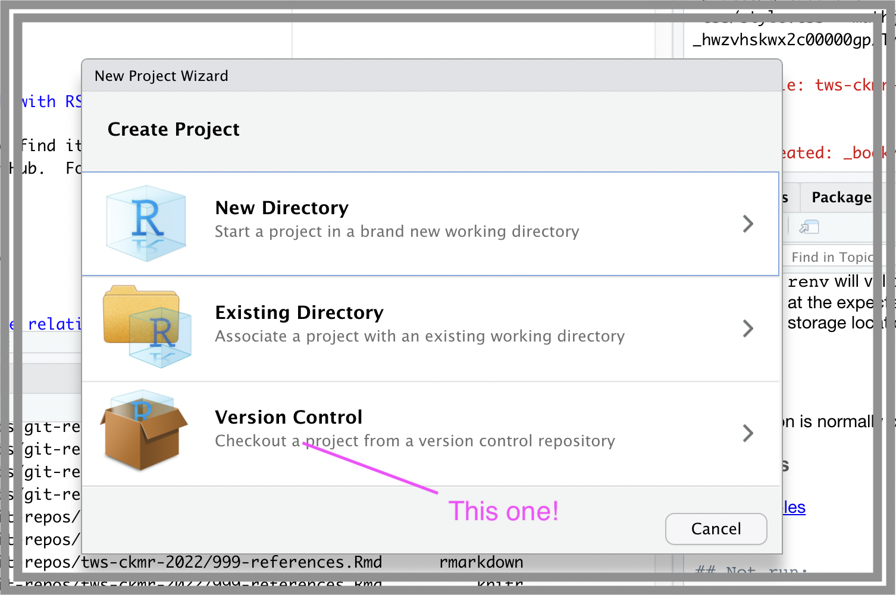
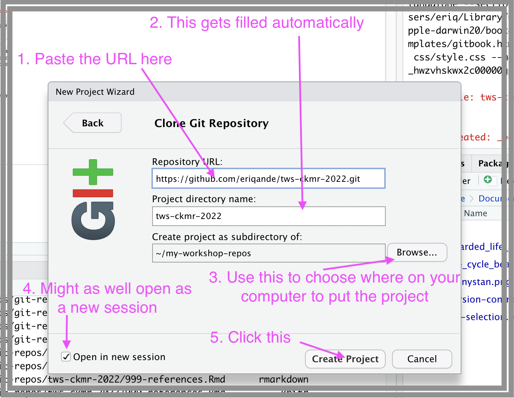
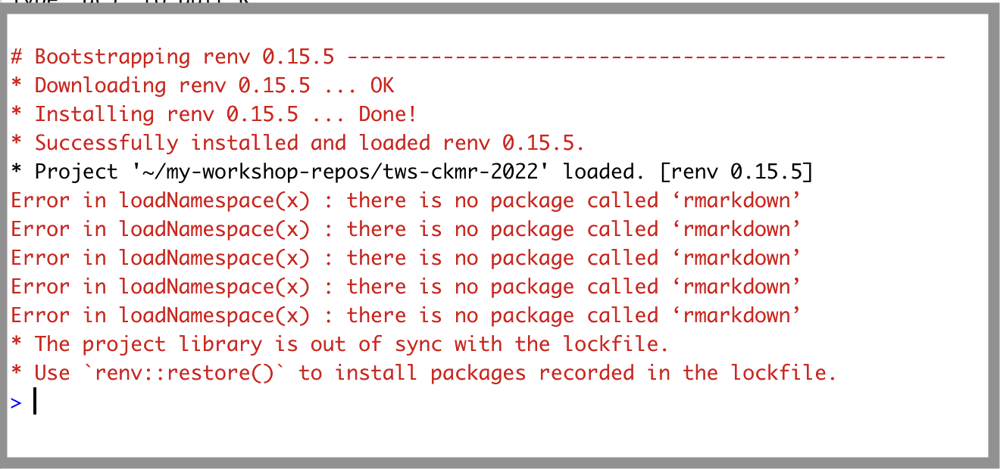
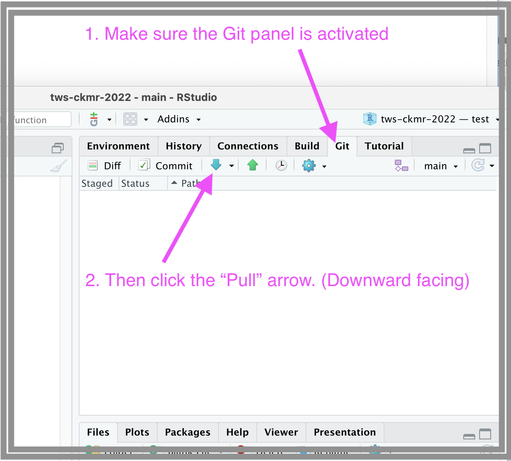

--- 
title: "Close-kin mark-recapture: theory and practice --- Spokane, Washington, USA"
author: "Paul B. Conn and Eric C. Anderson"
date: "`r Sys.Date()`"
documentclass: krantz
bibliography: ["references.bib"]
biblio-style: apalike
csl: molecular-ecology.csl
link-citations: yes
colorlinks: yes
lot: yes
lof: yes
site: bookdown::bookdown_site
description: "A book example for a Chapman & Hall book."
github-repo: yihui/bookdown-crc
graphics: yes
#cover-image: images/cover.jpg
header-includes: 
  - \usepackage{booktabs}
fig-retina: 2
---


```{r setup, include=FALSE}
options(
  htmltools.dir.version = FALSE, formatR.indent = 2, width = 55, digits = 4
)
```

# Course Overview {-}

This is the website/book associated with the _Close-kin mark-recapture: theory and practice_ workshop to be held at The Wildlife Society meetings Nov 6, 2022 in Spokane, Washington.

## Workshop schedule {-}

An approximate schedule for the workshop is as follows.  Note that when
a session has slides for a lecture, they are linked below.

| Time      | Description | Instructor(s)     |
| :--:        |    :--------   |          --: |
8:00--8:45    |  Close-kin mark-recapture: An overview ([slides](https://eriqande.github.io/tws-ckmr-2022/slides/paul-talk-1.Rmd.html#/section)) | _P. Conn_  |
8:45--9:30    | An introduction to genetic data and inheritance ([slides](https://eriqande.github.io/tws-ckmr-2022/slides/eric-talk-1.html#/section))  | _E. Anderson_ |
9:30--9:45    | Break |   |
9:45--10:30   | Statistical inference for CKMR estimation ([slides](https://eriqande.github.io/tws-ckmr-2022/slides/paul-talk-2.Rmd.html#/section)) | _P. Conn_ |  
10:30--11:15  | Kin finding  |  _E. Anderson_   |  
11:15--12:00  | Designing a CKMR experiment ([slides](https://eriqande.github.io/tws-ckmr-2022/slides/paul-talk-3.Rmd.html#/section)) | _P. Conn_  |
12:00--1:00   | Lunch   |
1:00--5:00    | R/TMB labs (full day participants only)   | _P. Conn/E. Anderson_|   


Workshop attendees had the option of registering for half-day or full-day sessions.  The first half will consist almost entirely of lectures, with no previous programming experience needed. The second half will involve labs and exercises conducted in R and/or Template Model Builder (at the user's discretion).  

Full day participants should use the following set of instructions to set up their computers prior to the workshop.
Please do this within no more than a day or two of the workshop, as the materials will be evolving up to the day of 
launch! (Additionally, if you follow the instructions below, any new changes to the afternoon lab materials will be 
fast and easy to get).


```{r include=FALSE}
# put my knitr options here
options(knitr.graphics.auto_pdf = TRUE)
```

## Resources {-}

All the materials for the workshop, including this "book" and all of the slides
are located on github at 

https://github.com/eriqande/tws-ckmr-2022

The "website" version of the course which serves up this book and the
slides is available at

https://eriqande.github.io/tws-ckmr-2022/

These course materials will remain publicly available in perpetuity at the above
addresses.  We might occasionally update them as well.

There is also additional material and examples that may be of interest at

https://closekin.github.io/


## Setting up your computer {.unnumbered #setting-computer}

_This is only really necessary if you are signed up for the full day course_

This course covers topics in close-kin mark recapture, and the second half of the course relies
heavily on the R programming language.  In order to follow
along with the code and be successful in running all of the
examples, it will be helpful (if not imperative) for full-day workshop participants to have recent versions of
R and RStudio.

### Step 1. Install recent versions of R and RStudio {-}

The workshop materials were developed using:

- R versions 4.1 and 4.2
- Rstudio Version >= 2022.07.01

If you have an older version of either of those applications, you should
install the latest.

**Important** Several of the packages must be compiled locally on your laptop,
and the TMB package operates by compiling C++ code.  Accordingly, in addition
to installing R, and RStudio, you must have a compile/build chain on your computer:

* On a Mac, you need to do `sudo xcode-select --install` as described [here](https://mac.r-project.org/tools/).
Note that this requires admin privileges, so, if your computer is administered by your agency or university IT department, get this done before arriving in Spokane.
* For Windows, you must download and install the Rtools as available [here](https://cran.r-project.org/bin/windows/Rtools/).


We have tested the workshop materials on several platforms:

- a Mac with an Intel chip running BigSur OSX 11
- a Mac with an M1 (Apple silicon) chip running Monterey version 12.6
- a PC running Windows 10.  

We suspect it will 
also work on most other Mac or Windows operating systems.

### Step 2. Make sure that you have `git` installed on your system {-}

* If you are on a Mac and successfully did `sudo xcode-select --install`, then
you will have `git`.
* If you are on a PC and you do not have git, then follow the
instructions in the excellent (HappyGitWithR)[https://happygitwithr.com/] book,
specifically the ["highly recommended" option 1](https://happygitwithr.com/install-git.html#install-git-windows).

#### A further word on `git` {-}

Although the distribution our workshop materials depends heavily on `git`, and the cloud-based code management
system GitHub, that is built upon git, we won't have the time to delve deeply into
these topics.

You can do everything you need to do for this workshop without having an account on
GitHun, but, if you are interested in version control for
your analyses, and you are interested in using GitHub to share and present the results
of your research, then you really will want to become proficient with both `git` and
GitHub. Once again, the online book [https://happygitwithr.com/](https://happygitwithr.com/)
is highly recommended.


### Step 3. Get the workshop materials from GitHub with RStudio {-}

Once `git` is installed and RStudio knows where to find it, RStudio can
use it to download the workshop materials from GitHub.  Follow these 
steps:

1. Open RStudio
2. From the dropdown menus, choose File -> RStudio
3. In the resulting pop-up window choose and click "Version Control":
    
4. In the next screen of the "wizard" choose "Git":
    
5. In the next screen of the wizard, paste the following URL
    into the Repository URL box.
    ```{sh, eval=FALSE}
    https://github.com/eriqande/tws-ckmr-2022.git
    ```
    Then use the "Browse" button to tell where you want the project
    to be stored on your computer (that is up to you!), click 
    "Open in new session" (why not---no reason to close out whatever
    you were working on in another RStudio project), and then click 
    "Create Project":
    
    RStudio then downloads the project and opens it for you.  It also
    detects that the project is using the 'renv' package (see below) and
    tells you how to get all the packages you need.  It should look something like this:
    .

6. To get all the packages, paste these lines into your R console in RStudio:
    ```{r, eval=FALSE}
    install.packages("rmarkdown")
    renv::restore()
    ```
    That should start with 'renv' giving you a list of all the packages that will
    be installed or updated in the repository-local library tree (this should not change
    versions of packages in your own use-wide or system-wide collection of packages), and
    it will ask something like:
    ```{sh, eval=FALSE}
    Do you want to proceed? [y/N]: 
    ```
    Enter `y`.  
    That should launch what could be a fairly lengthy process of downloading, compiling
    (a few, at least) and installing all the R packages we need, and their dependencies.


That should do it, and if it works for most everyone in the course with relatively few
hitches, then it is a testament to how well the 'renv' package is implemented. If there are
some hiccups, we will try our best to help you deal with them.


### Updating the project

It is possible that the course instructors may update the project repository
with new information, code, or content after you have followed the steps
above to do the initial installation. 

Fortunately, it is easy to get those updates from GitHub.  Updating your
project can be done in these two easy steps:

1. Pull the changes down from GitHub.  In RStudio, this means hitting the
    "Pull" button in the Git panel:
    
2. Then in the R console, execute the command.
    ```{r, eval=FALSE}
    renv::restore()
    ```

That's it!

## A word about the 'renv' package  {-}

Our work will require a number of packages that can be found in binary
form on CRAN.  As well as several that require compilation from source
on GitHub. This is why the compile/build chain (see above) is essential.

This year, we are using the '[renv](https://rstudio.github.io/renv/articles/renv.html)'
package to help with installing
the necessary packages in an isolated R library on your computer.  The 'renv'
package guides the installation of all the packages (with specific version
numbers that we have tested for this workshop) into a local R library associated
with the workshop's RStudio project.  This means that installing all these
new packages will not overwrite your current R library tree.  So, nothing that
we do should change the way your current R setup works in other projects (fingers crossed!).

## A word about the TMB package {-}

In the full day workshop we will make some use of Template Model Builder (TMB); attendees might
wish to familiarize themselves with how it works by reading some of its documentation,
such as that at https://kaskr.github.io/adcomp/Introduction.html).

For the mathematically or computationally inclined, the
[article about TMB on arXiv](https://arxiv.org/abs/1509.00660) might be a fun
read.

