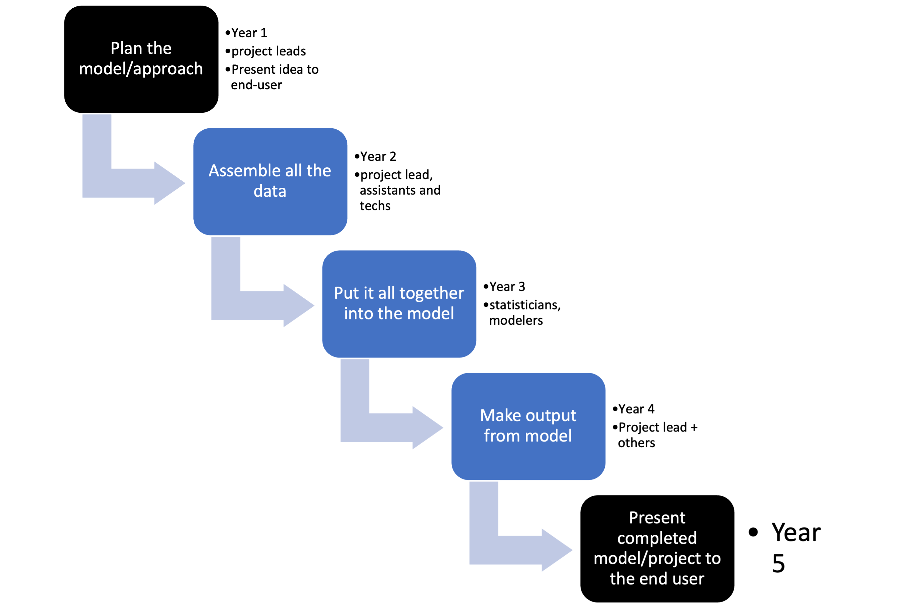

layout: true

.footnote[U.S. Department of Commerce | National Oceanic and Atmospheric Administration | National Marine Fisheries Service]


```{r setup, include=FALSE}
options(htmltools.dir.version = FALSE)
```

---

class: middle

### Note there are tons on info online + videos on agile project management. 

---

## What kinds of projects are we talking about?

**Complex projects**

* big tasks with lots of different stages
* potentially many different team members and different needed skills 
* Often team projects but could also be a solo project
* Examples: a large report or manuscript, a complex model, a software package, or an software application.


---

# What is agile?


.pull-left[
A **lightweight** workflow **structure** for software development which is characterized by 4 key features -->

Traced back to the [Agile Manifesto](https://agilemanifesto.org/) (4 statement and 12 principles) written at a 2001 gathering of software development "visionaries", but the ideas trace back much earlier. [Good overview on Wikipedia](https://en.wikipedia.org/wiki/Agile_software_development). 

Today agile methodologies are the norm in software development.
]
.pull-right[
- Rapid incremental and iterative development
- Open team culture - autonomous, highly communicative, empowered
- Team reflection and continual improvement
- Customer focus - early and frequent delivery of workable products
]

---

class: middle


.footnote[Radical Candor is a book by Kim Scott.<br><br>]
---

## What it is not: Waterfall

Let's imagine that we are preparing a big report or perhaps we have put in a, successful, proposal for a new big modeling project to address some management issue.

.center[

]

---

<!--
A key feature of the 'Waterfall' approach is "Big Design Upfront": you have a fully fleshed out plan for the project from start to finish. The way we often get funding forces us into the "Big Design Upfront" paradigm, aka a detailed research proposal that lays out what we are going to do and how.
-->


# Originating Ideas


---

## Industrial quality control

A key element of agile methodologies is iterative cycles, similar to the Plan-Do-Check-Act (PDCA) cycle:

.center[

]

This was popularized by the work of **William Edwards Deming**<sup>1</sup> on how to design workflow and organizational systems that improve quality control, though the ideas are traced back to the 1930-50s with work on industrial quality control systems (e.g., Walter A. Shewhart cycle) and earlier ideas on the scientific method.

.footnote[[1] Leading thinker in statistical quality control and industrial engineering in the 1950s to 1980s.<br><br>]
---

class: middle

.center[

]

---

## Lean manufacturing

.pull-left[

]

.pull-right[
Lean manufacturing refers to a profound change in the structure and culture of manufacturing teams to a flat hierarchy with

* intense focus on empowering of and continual learning by individual team members
* systems (workflows) that are self-organizing, self-correcting, and spontaneously continually improving

The origin of these ideas is also credited to W. Edwards Deming, but adopted earliest in Japan where he visited to train Japanese engineers in quality control in the post-WWII period.
]


---

class: middle

.center[

]

---

## Rapid software application development theory

Lastly, agile is related to work in the 1980s on systems for rapid innovation for software application development  (Barry Boehm, James Martin, James Kerr). 

By definition, innovation is creating something novel so you can't write a plan to get to the "product" because you don't know what the product is. Because the customer (who you don't yet since you are developing something new) has never seen the product, the design process is organic and knowledge gained from the development process itself affects the design at each cycle.

* Rapid iterations with learning
* Working demos (prototypes)
* Tight collaboration with "customer"
* Team culture: autonomous teams where members plan their own work and work their own plans.

---

class: middle

.center[

]

---

## Experiential learning

In "experiential learning" (David A Kolb, 1970s-1980s), the activity is the teacher via explicit periods of reflection and experimentation (trying something to fix the identified problem). 

.center[

]

---

class: middle


---

class: middle

# Agile methodologies

---

## Kanban

.center[

]

---

## Why use a Kanban board?

Visualize the flow of work so that we can improve it incrementally and organically--meaning no fixed framework. Just seeing your workflow helps you see the problems.

* transparency -- visual representation of the team's workflow

* iterative and incremental -- each task is a well-defined task (ca 1-2 days to move columns)

* "workable product" -- minimize work in progress and **finish tasks before taking on new tasks** "WIP limits"

* problems with task "flow" are addressed as they arise

* No "sprints", time-boxed tasks, or time targets.

.footnote[Atlassian has a nice Kanban video series: [intro](https://www.youtube.com/watch?v=iVaFVa7HYj4), [designing your Kanban board](https://www.youtube.com/watch?v=Bcid33tgq8A), [work in progress limits](https://www.youtube.com/watch?v=zEJn6eQO6FE), [writing kanban cards](https://www.youtube.com/watch?v=PxXdcQrPIUI) <br><br>]

---

## Kanban cards: aka the task card

Each project task lives on a card that gets edited as it moves. Team members can add comments and notes as it moves.

* a description
* deadline
* assigned team member(s)
* small: 1-2 days of work (not 1 hour)

---


---

## Example: NWFSC OA Lab

@Paul McElhany, NWFSC


---

## Kanban with GitHub

Let's Kanban with GitHub! 

Note,

* Kanban boards are often physical boards. 
* Lots of different applications for online Kanban boards.
* Online versions allow you to link cards to "issues", e.g. GitHub issues.


